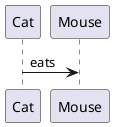

# Convert PlantUML to diagrams.net XML

[](https://github.com/SantosVilanculos/plantuml-to-drawio/actions)
[](https://github.com/SantosVilanculos/plantuml-to-drawio/releases)
[](https://github.com/SantosVilanculos/plantuml-to-drawio/blob/main/LICENSE)
[](https://github.com/SantosVilanculos/plantuml-to-drawio/commits/main)

A command-line tool to transform your PlantUML diagrams into fully editable diagrams.net (formerly draw.io) files. This utility is designed for anyone who wants to seamlessly integrate their documentation workflows.

## ✨ Features

- **Direct Conversion:** Convert your `.plantuml` files to `.drawio` XML format effortlessly.
- **Embedded Content:** The original PlantUML source code and the rendered SVG are embedded within the diagrams.net XML, allowing for easy access and editing.
- **Interactive Diagrams:** Double-click the converted diagram in diagrams.net to reveal and edit the PlantUML source. If the PlantUML library is loaded in diagrams.net, changes will update the diagram dynamically.
- **Command-Line Utility:** Integrate this script into your build processes or use it for quick, one-off conversions.

## 🚀 Getting Started

### Prerequisites

Before you can use this script, ensure you have the following installed:

- **Java:** The script relies on the PlantUML JAR, which requires a Java Runtime Environment. Tested with OpenJDK 21 and Amazon Corretto 17.
- **Graphviz (for Linux users):** The `dot` command, part of the `graphviz` package, is necessary for rendering certain PlantUML diagrams. If you're on Linux, you can install it with:

  ```bash
  sudo apt-get install graphviz
  ```

- **diagrams.net / draw.io:** While not strictly required to _run_ the script, you'll need diagrams.net (desktop application or web) to open and interact with the generated XML files. Tested with diagrams.net ^24.3.1.

### Installation

The `plantuml-to-drawio` tool is distributed as a standalone executable.

1. **Download the latest release:** Visit the [releases page](https://github.com/SantosVilanculos/plantuml-to-drawio/releases) and download the appropriate executable for your operating system (e.g., `plantuml-to-drawio_win.exe` for Windows, `plantuml-to-drawio_linux` for Linux, etc.).
2. **Make it executable (Linux/macOS):** If you're on Linux or macOS, you might need to make the downloaded file executable:

   ```bash
   chmod +x plantuml-to-drawio_linux # or your downloaded file name
   ```

3. **Place it in your PATH (optional but recommended):** For easy access from any directory, move the executable to a directory included in your system's `PATH` (e.g., `/usr/local/bin` on Linux/macOS, or any directory added to your `Path` environment variable on Windows).

### Creating a PlantUML File

If you're new to PlantUML, here's a simple example to get you started. Save this code in a file named `cat-eats-mouse.plantuml`:



### Converting to diagrams.net XML

Now, use the `plantuml-to-drawio` command to convert your PlantUML file.

You'll need to provide the **input PlantUML file path** and specify an **output file path** using the `-o` or `--output` option.

```bash
plantuml-to-drawio cat-eats-mouse.plantuml --output cat-eats-mouse.drawio
```

#### Command Line Options

You can view all available options and their descriptions by running:

```bash
plantuml-to-drawio --help
```

**Key Options:**

- **`path` (positional argument):** The path to your `.plantuml` file you wish to process.
  - Example: `plantuml-to-drawio my_diagram.plantuml ...`
- **`-o, --output PATH` (required):** Specifies the path where the generated `.drawio` XML file will be saved.
  - Example: `... -o output/diagram.drawio`
- **`-d, --debug` (flag):** Enable debug mode. Include this flag if you need more verbose output for troubleshooting.

### Opening in diagrams.net

You have a couple of options for opening the generated `.drawio` file in diagrams.net:

- **Open as a new diagram:**

  1. In diagrams.net, go to `File` > `Open from` > `Device...`
  2. Select the `cat-eats-mouse.drawio` file.

- **Import into an existing diagram:**
  1. In diagrams.net, open your existing diagram.
  2. Go to `File` > `Import from` > `Device...`
  3. Select the `cat-eats-mouse.drawio` file.

## 🛠 How it Works

This script performs a series of steps to achieve the conversion:

1. **PlantUML to SVG:** Utilizes the PlantUML JAR and Java to convert the plain text PlantUML code into an SVG image.
2. **SVG Encoding:** Encodes the generated SVG data using Base64 for embedding within the XML.
3. **PlantUML Text Encoding:** Encodes the original PlantUML text data to be safe for embedding in XML/HTML/URL formats.
4. **Dimension Extraction:** Parses the SVG data to extract its dimensions (width and height) for proper rendering in diagrams.net.
5. **Last Modified Date:** Retrieves the last modification date of the input PlantUML file to set as the revision date in the diagrams.net XML.
6. **XML Generation:** Constructs the diagrams.net XML file, embedding the encoded SVG and PlantUML text, and outputs it to standard output.

---

## 🏗 Building from Source

If you wish to build the executable binary from the source code, follow these steps:

1. Make the build script executable:

   ```bash
   chmod +x ./build.sh
   ```

2. Run the build script:

   ```bash
   ./build.sh
   ```

   This will create a `dist` folder containing the compiled binary.

## 📜 License

This project is licensed under the Apache License 2.0. See the [LICENSE](./LICENSE) file for details.

This program is free software.

## 🙏 Credits

This script is based on the work of [Russell Glaue](https://github.com/rglaue/plantuml_to_drawio).
